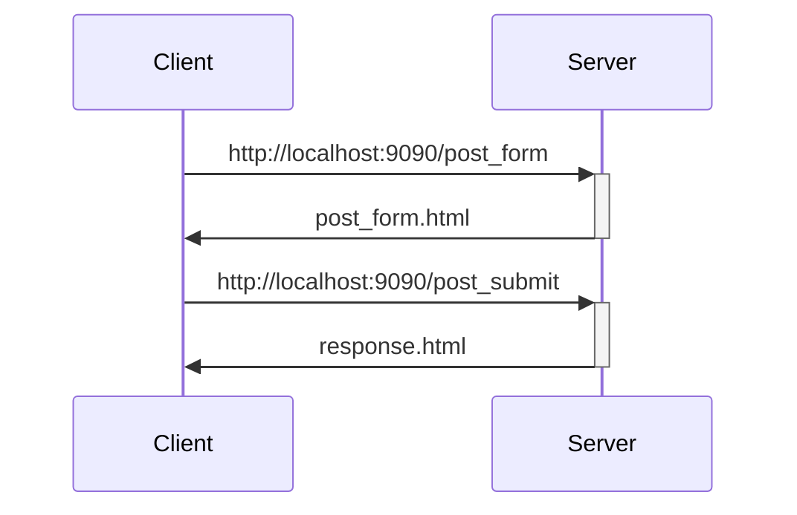

# flask_ex1
A docker environment for Flask with coding examples

Open a shell and move to the flask_ex1 folder. Under the folder, execute the following commend
```
docker build -t flask_ex1 .
``` 

After build the image, you can check the image by using the following command
```
docker image ls
```
You should see a image flask_ex1.

```
docker run -itd -p 9090:9090 --rm -v ${PWD}/app:/src/app --name flask_ex1_con flask_ex1
```

You can check the flask server log by using docker container logs command

```
docker logs flask_ex1_con -f
```

To view the page, 
- First page:
    - http://localhost:9090
- Home page:
    - http://localhost:9090/home
- Home page with control variable cval (cval=1 or 0) sent over HTTP GET method:
    - http://localhost:9090/home?cval=1
    - http://localhost:9090/home?cval=0
    - http://localhost:9090/home (the same as cval=0 because default value = 0)
- Post form page and its response:
    - http://localhost:9090/post_form
    - Response page after post form submission (route is /post_submit)

HTTP Request and Response Flow


Reference of Using "Session" Variables
- https://testdriven.io/blog/flask-sessions/ 


For tests

```
pip install pytest
``` 

```
pytest
``` 
